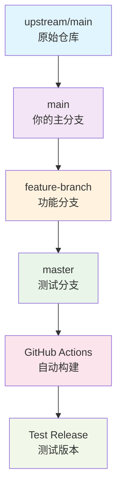

# 🌳 分支结构和工作流程详解

## 📊 当前分支结构

基于你的仓库，这是完整的分支结构和用途：

```
📁 你的复刻仓库 (Usagi-wusagi/StarRailAssistant)
├── 🌟 master          ← 【测试构建分支】专门用于合并测试
├── 🏠 main            ← 【主分支】跟随上游的主要分支
├── 🧪 test            ← 【功能测试分支】你的测试代码
├── 🔧 chore/notify-test ← 【功能分支】通知功能测试
│
📡 远程分支:
├── origin/master      ← 你的远程 master 分支
├── origin/main        ← 你的远程 main 分支
├── origin/chore/notify-test ← 你的远程功能分支
│
🔗 上游分支 (原始仓库):
├── upstream/main      ← 原始仓库主分支
├── upstream/dev       ← 原始仓库开发分支
└── upstream/GUI_dev   ← 原始仓库 GUI 开发分支
```

## 🔄 推荐的工作流程

### 1. 日常开发流程



### 2. 具体操作步骤

#### 步骤 1: 同步上游更新
```bash
# 获取上游最新更改
git fetch upstream
git checkout main
git merge upstream/main
git push origin main
```

#### 步骤 2: 创建功能分支开发
```bash
# 从 main 创建新的功能分支
git checkout main
git checkout -b feature/your-new-feature

# 开发你的功能...
git add .
git commit -m "Add new feature"
git push origin feature/your-new-feature
```

#### 步骤 3: 合并到 master 进行测试
```bash
# 使用我们的脚本自动合并
python merge-to-master.py --branch feature/your-new-feature

# 或者手动合并
git checkout master
git merge feature/your-new-feature --no-ff
git push origin master  # 这会触发 GitHub Actions 构建
```

#### 步骤 4: 测试和验证
- GitHub Actions 自动构建
- 下载测试 Release 进行验证
- 如果有问题，回到步骤 2 修复

#### 步骤 5: 合并到主分支（可选）
```bash
# 测试通过后，合并到 main
git checkout main
git merge feature/your-new-feature
git push origin main
```

## 🎯 各分支的具体用途

### 🌟 master 分支
- **专门用途**: 测试构建和 CI/CD
- **触发条件**: 推送到此分支会自动触发 GitHub Actions
- **构建产物**: 自动生成测试 Release
- **命名规则**: `test-v{版本}-{时间戳}`
- **不要直接开发**: 只用于合并其他分支进行测试

### 🏠 main 分支
- **用途**: 你的主要开发分支
- **同步**: 定期从 upstream/main 同步
- **稳定性**: 保持相对稳定的代码
- **发布**: 可以用于正式发布

### 🧪 功能分支 (test, chore/notify-test 等)
- **用途**: 开发具体功能
- **生命周期**: 功能完成后可以删除
- **测试**: 合并到 master 进行测试
- **命名建议**:
  - `feature/功能名`
  - `bugfix/问题描述`
  - `chore/维护任务`

## 📋 分支管理最佳实践

### ✅ 推荐做法

1. **保持 master 分支纯净**
   ```bash
   # ❌ 不要直接在 master 上开发
   git checkout master
   git add . && git commit -m "直接修改"  # 不推荐

   # ✅ 应该这样做
   git checkout -b feature/new-change
   git add . && git commit -m "新功能"
   python merge-to-master.py --branch feature/new-change
   ```

2. **定期同步上游**
   ```bash
   # 每周或每次开发前执行
   git fetch upstream
   git checkout main
   git merge upstream/main
   git push origin main
   ```

3. **清理旧分支**
   ```bash
   # 删除已合并的功能分支
   git branch -d feature/completed-feature
   git push origin --delete feature/completed-feature
   ```

### ⚠️ 注意事项

1. **master 分支冲突处理**
   - 如果合并到 master 时有冲突，先在功能分支解决
   - 不要在 master 分支直接解决冲突

2. **测试 Release 管理**
   - 定期清理旧的测试 Release
   - 测试 Release 仅用于验证，不用于生产

3. **权限设置**
   - 确保 GitHub Actions 有创建 Release 的权限
   - 检查仓库的 Actions 设置是否启用

## 🔧 故障排除

### 问题 1: GitHub Actions 构建失败
```bash
# 检查工作流文件语法
cat .github/workflows/fork-build.yml

# 查看构建日志
# 访问 GitHub 仓库 → Actions → 查看失败的构建
```

### 问题 2: 合并冲突
```bash
# 在功能分支解决冲突
git checkout feature/your-branch
git merge master
# 解决冲突后
git add .
git commit
git checkout master
git merge feature/your-branch
```

### 问题 3: 分支同步问题
```bash
# 重置 master 分支到远程状态
git checkout master
git fetch origin
git reset --hard origin/master
```

这个分支结构让你可以：
- 🔄 轻松同步上游更新
- 🧪 安全地测试新功能
- 🚀 自动化构建和发布
- 🛡️ 保持主分支稳定